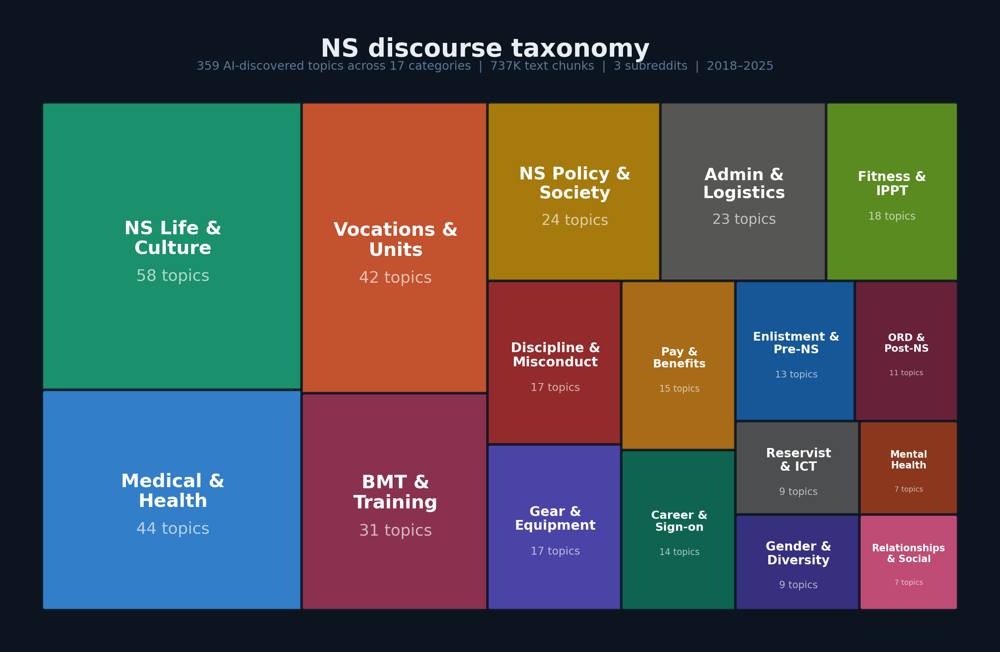

# NS Sentinel

**NLP analysis of National Service discourse on Singapore Reddit (2018–2025)**

NS Sentinel is an end-to-end NLP pipeline and interactive dashboard that analyses public sentiment toward National Service (NS) across three Singapore subreddits: r/singapore, r/askSingapore, and r/NationalServiceSG. It processes ~550K Reddit documents (57K posts + 492K comments) into 737K semantic text chunks, classifies sentiment and commitment signals, models 359 fine-grain discussion topics, and presents the results through a 7-page Streamlit dashboard with a RAG-powered chatbot.

---

## Key capabilities

| Capability | Detail |
|---|---|
| **Sentiment classification** | SingBERT v7 — `zanelim/singbert-large-sg` fine-tuned on 3-class (positive / neutral / negative) Singapore English. 83.9% accuracy, Cohen's κ = 0.714, macro F1 = 0.78 on a 217-row human gold set. |
| **Commitment classification** | 4-stage cascade classifier on two independent axes: **Buyin** (committed ↔ uncommitted — personal investment in NS) and **Stance** (supportive ↔ critical — opinion on NS policy). Buyin F1 = 0.714, Stance F1 = 0.784 on a 727-row human gold set. |
| **Topic modelling** | BERTopic with manual taxonomy: 359 leaf → 112 cluster → 52 sub → 17 macro topics. Full hierarchical treemap with drill-down. |
| **Divergence analysis** | Post-vs-comment tone shift detection. Identifies threads where the community response differs from the original post's sentiment. |
| **RAG chatbot** | FAISS retrieval over 737K chunks + Groq Llama 3.3 70B synthesis (free tier). Answers both quantitative ("what % of posts about BMT are negative?") and qualitative ("what do people say about NS pay?") questions. |
| **Interactive dashboard** | 7-page Streamlit app with dark/light mode, subreddit + year filters, and full drill-down from macro topics to individual posts. |

---

## Project structure

```
ns_sentiment/
├── app/
│   └── dashboard.py              # Streamlit dashboard (Stage 9)
├── config.py                     # Global paths and constants
├── data/
│   ├── raw/                      # ZST Reddit dumps (gitignored)
│   ├── interim/                  # Cleaned parquets (gitignored)
│   └── processed/new/            # Pipeline outputs (parquets, CSVs, JSON)
│       └── cascade/              # Cascade classifier training data
├── models/new/
│   ├── singbert_v7/              # Fine-tuned SingBERT (weights gitignored)
│   ├── bertopic_fine/            # 359-topic BERTopic model
│   └── bertopic_coarse/          # 17-macro BERTopic model
├── notebooks/
│   ├── kaggle_*.ipynb            # Kaggle GPU notebooks for training/inference
│   └── cascade/                  # Cascade classifier training notebooks
├── scripts/
│   ├── rag/                      # RAG knowledge-base build scripts
│   └── rebuild_*.py              # Data rebuild utilities
├── src/
│   ├── data/                     # Stage 1–2: loading & cleaning
│   ├── features/                 # Stage 3–5: chunking, annotation, commitment
│   ├── models/                   # Stage 4: BERTopic + topic taxonomy
│   ├── analysis/                 # Stage 6–8: aggregation, divergence, temporal
│   └── rag/                      # RAG chatbot components
├── User_Guide/
│   ├── pipeline.md               # Detailed pipeline documentation
│   └── dashboard_guide.md        # Dashboard user guide
└── requirements.txt
```

---

## Pipeline stages

| Stage | Script / notebook | Description |
|-------|-------------------|-------------|
| 1 | `src/data/loader.py` | Decompress ZST Reddit dumps → interim parquets |
| 2 | `src/data/cleaner.py` | Filter NS-relevant content, remove bots, clean text |
| 3 | `src/features/chunker.py` | Semantic chunking with sentence-transformers embeddings |
| 4 | `notebooks/kaggle_topic_model_v3.ipynb` | BERTopic topic modelling (Kaggle GPU) |
| 5a | `notebooks/kaggle_finetune_singbert_v1.ipynb` | Fine-tune SingBERT for 3-class sentiment |
| 5a | `notebooks/kaggle_infer_singbert_v1.ipynb` | Run SingBERT inference on all 737K chunks |
| 5b | `notebooks/cascade/` | Train + infer 4-stage cascade commitment classifier |
| 6 | `src/analysis/stage6_doc_aggregation.py` | Roll up chunk scores to document level |
| 7 | `src/analysis/stage7_divergence_v2.py` | Post-vs-comment divergence scores |
| 8 | `src/analysis/stage8_temporal.py` | Monthly temporal aggregation |
| 9 | `app/dashboard.py` | Streamlit dashboard |
| RAG | `scripts/rag/build_*.py` | Build FAISS index, topic digests, fact table |

For detailed documentation of each stage, see [User_Guide/pipeline.md](User_Guide/pipeline.md).

---

## Quick start

### 1. Clone and install

```bash
git clone https://github.com/kevinn-chan/NS-Sentiment-Analysis-NLP.git
cd NS-Sentiment-Analysis-NLP
python -m venv .venv
source .venv/bin/activate
pip install -r requirements.txt
python -m spacy download en_core_web_sm
```

### 2. Run the dashboard

```bash
streamlit run app/dashboard.py
```

The dashboard loads pre-computed parquets from `data/processed/new/`. All data files needed for the 6 main dashboard pages are included in this repository — **no extra downloads needed**.

### 3. Full setup (Sentinel Bot + pipeline re-runs)

The RAG chatbot and pipeline re-runs require large files that exceed GitHub's 100 MB limit. If you have access to a machine that already has the project (e.g., transferring to a new laptop), copy these files into the cloned repo:

```bash
# From the source machine, serve the project folder over the network:
cd /path/to/ns_sentiment
python -m http.server 8080

# On the new machine, download the large files into the cloned repo:
cd NS-Sentiment-Analysis-NLP

# Required for Sentinel Bot (5.4 GB total):
curl -o data/processed/new/comments_chunks.parquet    http://<source-ip>:8080/data/processed/new/comments_chunks.parquet
curl -o data/processed/new/submissions_chunks.parquet http://<source-ip>:8080/data/processed/new/submissions_chunks.parquet
curl -o data/processed/new/chunk_faiss.index          http://<source-ip>:8080/data/processed/new/chunk_faiss.index

# Required for re-running sentiment inference (1.2 GB):
curl -o models/new/singbert_v7/model.safetensors      http://<source-ip>:8080/models/new/singbert_v7/model.safetensors
curl -o models/new/singbert_v7/training_args.bin      http://<source-ip>:8080/models/new/singbert_v7/training_args.bin

# Required for re-running pipeline from scratch (3.9 GB total):
mkdir -p data/raw data/interim
curl -o data/raw/singapore_comments.zst               http://<source-ip>:8080/data/raw/singapore_comments.zst
curl -o data/raw/singapore_submissions.zst             http://<source-ip>:8080/data/raw/singapore_submissions.zst
curl -o data/raw/askSingapore_comments.zst             http://<source-ip>:8080/data/raw/askSingapore_comments.zst
curl -o data/raw/askSingapore_submissions.zst          http://<source-ip>:8080/data/raw/askSingapore_submissions.zst
curl -o data/raw/NationalServiceSG_comments.zst        http://<source-ip>:8080/data/raw/NationalServiceSG_comments.zst
curl -o data/raw/NationalServiceSG_submissions.zst     http://<source-ip>:8080/data/raw/NationalServiceSG_submissions.zst
curl -o data/interim/comments_raw.parquet              http://<source-ip>:8080/data/interim/comments_raw.parquet
curl -o data/interim/submissions_raw.parquet           http://<source-ip>:8080/data/interim/submissions_raw.parquet
```

Finally, create a `.env` file in the project root with an LLM API key for the Sentinel Bot:

```
GROQ_API_KEY=gsk-...          # Primary — Groq Llama 3.3 70B (free tier, 7K requests/month)
OPENAI_API_KEY=sk-...         # Fallback — GPT-4o-mini
ANTHROPIC_API_KEY=sk-ant-...  # Fallback — Claude Haiku
```

Only one key is needed. Groq is recommended as it provides free-tier access.

---

## Large files not in this repository

These files exceed GitHub's 100 MB limit and are excluded via `.gitignore`:

| File | Size | Needed for | How to regenerate |
|------|------|-----------|-------------------|
| `data/raw/*.zst` | 1.9 GB total | Stage 1 | Download from [Pushshift](https://the-eye.eu/redarcs/) or [Academic Torrents](https://academictorrents.com/) |
| `data/interim/*.parquet` | 2.1 GB total | Stage 2 | Run `python -m src.data.loader` |
| `data/processed/new/comments_chunks.parquet` | 2.9 GB | RAG, Stage 6 | Run `python -m src.features.chunker` |
| `data/processed/new/submissions_chunks.parquet` | 460 MB | RAG, Stage 6 | Run `python -m src.features.chunker` |
| `data/processed/new/chunk_faiss.index` | 2.1 GB | RAG chatbot | Run `python scripts/rag/build_index.py` |
| `models/new/singbert_v7/model.safetensors` | 1.2 GB | Sentiment inference | Fine-tune via `notebooks/kaggle_finetune_singbert_v1.ipynb` or download from the fine-tuned model |

---

## What works out of the box after cloning

GitHub enforces a 100 MB per-file hard limit. The 6 files listed above total ~8.5 GB and cannot be stored in the repository. All remaining pipeline outputs — the pre-computed parquets that power the dashboard — **are** included, so most of the dashboard works immediately after cloning.

### Fully functional (all data included)

| Page | Status | Notes |
|------|--------|-------|
| **Overview** | Works | All KPIs, sentiment-over-time chart, distribution chart, top negative topics |
| **Sentiment Trends** | Works | All 5 sub-tabs (net sentiment, % negative, % positive, full stack, grievance amplification) |
| **Topic Analysis** | Works | All 7 sub-tabs (treemap, drill-down, over time, rankings, volume, sentiment by topic, stance by topic) |
| **Divergence** | Works | All 3 sub-tabs (tone shift matrix, community battlegrounds, opinion density) |
| **Commitment** | Works | All 3 sub-tabs (commitment decline, signal detail, by topic) |
| **Population** | Works | All visualisations (flairs, posting activity, subreddit breakdown, top authors) |

### Not functional without additional setup

| Page | What's missing | Why |
|------|---------------|-----|
| **Sentinel Bot** | `comments_chunks.parquet` (2.9 GB), `submissions_chunks.parquet` (460 MB), `chunk_faiss.index` (2.1 GB) | The RAG chatbot embeds the user's question and searches a FAISS index over all 737K chunk embeddings to retrieve relevant passages. The chunks parquets contain the full text of every chunk (needed to display retrieved results), and the FAISS index contains the 768-dimensional embedding vectors for similarity search. These three files alone total 5.4 GB — 54x GitHub's per-file limit. |
| **Sentinel Bot** | `.env` with an LLM API key | Even with the data files present, the chatbot requires an API key for answer synthesis. Groq is the primary backend (Llama 3.3 70B, free tier — 7K requests/month). OpenAI and Anthropic are supported as fallbacks. Only one key is needed. |

### Not functional: re-running the pipeline from scratch

| Stage | What's missing | Why |
|-------|---------------|-----|
| Stages 1–2 (ingestion, cleaning) | `data/raw/*.zst` (1.9 GB) | Raw Reddit Pushshift dumps. Download from academic archives. |
| Stage 3 (chunking) | `data/interim/*.parquet` (2.1 GB) | Cleaned intermediate data. Regenerate by running Stages 1–2. |
| Stage 5a (sentiment inference) | `models/new/singbert_v7/model.safetensors` (1.2 GB) | Fine-tuned SingBERT model weights. The tokenizer and config files are included — only the 1.2 GB weights file is excluded. Retrain on Kaggle or download from the fine-tuned checkpoint. |

Re-running the pipeline is not required to use the dashboard — all outputs are pre-computed and included.

---

## Evaluation results

### Sentiment (SingBERT v7)

Evaluated on a 217-row human-annotated gold set (stratified by sentiment class):

| Metric | Score |
|--------|-------|
| Accuracy | 83.9% |
| Cohen's κ | 0.714 |
| Macro F1 | 0.78 |

### Commitment (4-stage cascade)

Evaluated on a 727-row human gold set:

| Axis | Task | F1 |
|------|------|----|
| Buyin | Relevance (Stage 1a) | 0.95 |
| Buyin | Committed vs Uncommitted (Stage 2a) | 0.714 |
| Stance | Relevance (Stage 1b) | 0.93 |
| Stance | Supportive vs Critical (Stage 2b) | 0.784 |

---

## Dashboard

For a detailed walkthrough of every dashboard page, see [User_Guide/dashboard_guide.md](User_Guide/dashboard_guide.md).



---

## Tech stack

- **Language models**: SingBERT (zanelim/singbert-large-sg), sentence-transformers/all-mpnet-base-v2
- **Topic modelling**: BERTopic with UMAP + HDBSCAN
- **Commitment**: 4-stage cascade of fine-tuned SingBERT classifiers (trained on Kaggle T4 GPUs)
- **Dashboard**: Streamlit + Plotly
- **RAG**: FAISS vector search + Groq Llama 3.3 70B synthesis (free tier; Anthropic/OpenAI fallbacks)
- **Data source**: Reddit Pushshift dumps (ZST format), 3 subreddits, 2018–2025

---

## License

This project was developed for academic and policy research purposes. The underlying Reddit data is sourced from public Pushshift archives.
